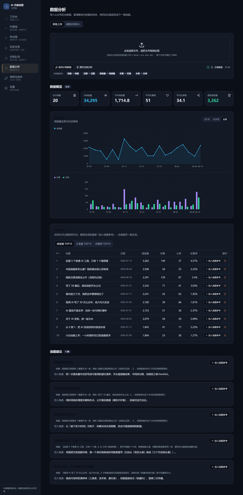
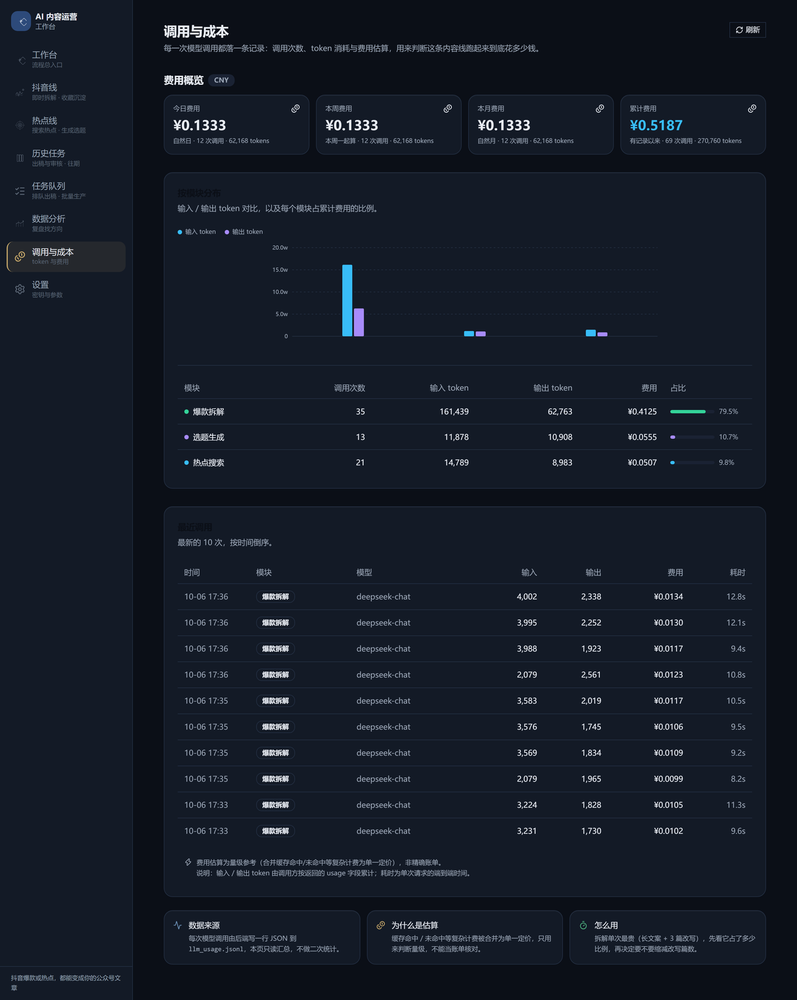
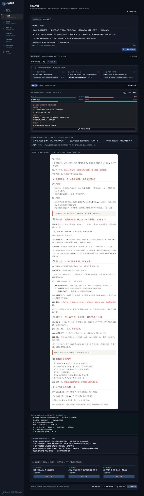
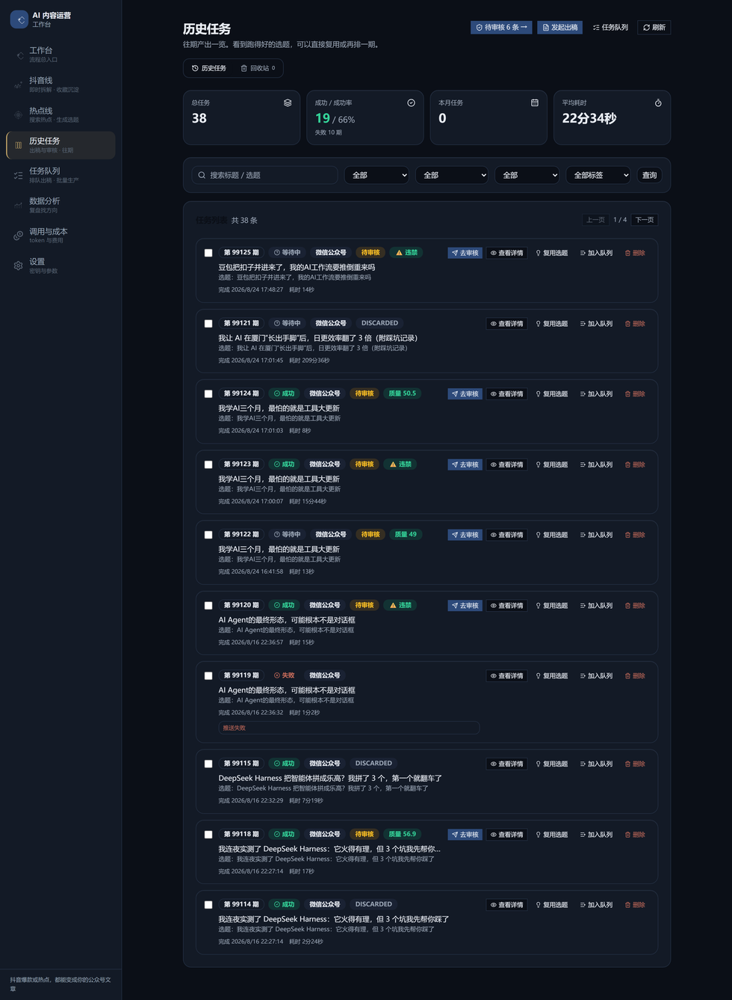

# AI 内容运营工作台（content-workbench）

> 面向「AI 内容运营」场景的全栈工作台：**热点发现 → 选题生成 → 内容生产 → 发布归档 → 数据复盘**。
> 前端 Next.js 14 + TypeScript，后端 FastAPI + Python，配套 **数据统计模块**、**LLM 用量与成本核算模块**、**API 额度管控模块**与 **59 个自动化测试**。

---

## 项目概况

| 指标 | 数值 |
|---|---|
| 后端代码 | **13,832 行 Python**（59 个文件，只计 git 跟踪的源码） |
| API 接口 | **87 个**（44 POST · 29 GET · 8 DELETE · 3 PUT · 3 PATCH） |
| 路由模块 | 12 个（11 个已挂载） |
| 服务层 | 4 个子包 · 27 个模块 |
| 自动化测试 | 后端 **59 个用例**（10 个文件）+ 前端 Vitest |
| 前端页面 | 10 个 · 组件 45 个 |
| 工程文档 | `docs/` 16 篇 + 部署手册 |

---

## 界面截图

> 均为本地真实运行截图（后端 `127.0.0.1:8000` + 前端 `127.0.0.1:3000`），数据来自实跑记录，未做美化。

**数据分析** —— 导入公众号后台数据后的概览、趋势与三类榜单；表现好的文章可一键加入选题参考。



**调用与成本** —— 每一次模型调用逐条记账，按今日 / 本周 / 本月 / 累计汇总，并按模块归因（热点搜索 · 选题生成 · 爆款拆解）。



**爆款拆解** —— 粘贴抖音口播稿，先拆出核心素材，再按「踩坑经历 / 干货总结 / 认知升级」三个角度并行改写；每篇给四维质量评分与按维度分组的改进建议，合规命中会直接拦下。



**历史任务** —— 往期产出一览，按期号分页，可按状态与标签筛选，支持复用选题、加入队列与删除。



---

## 解决什么问题

一个人做内容运营，真正的瓶颈不是"写不出"，而是这四件事：

1. **不知道写什么** —— 热点抓取 + 选题生成 + 选题库沉淀
2. **写完不知道好不好** —— 内容拆解与质量评分，把爆款拆成可复用的结构
3. **数据拿不回来** —— 公众号后台截图 → OCR 识别 → 人工确认 → 入库分析
4. **成本看不见** —— LLM 调用逐笔记账，按周期汇总费用并按模块归因

---

## 功能模块

### 内容生产链

| 模块 | 说明 |
|---|---|
| **热点搜索** | 关键词 + 时间范围检索；未配置搜索 API Key 时自动退回内置示例数据，不报错 |
| **选题生成** | 基于热点 + 历史数据洞察生成具体选题标题；含「学 / 用 / 赚」三大方向按 3 天一轮的日更轮换（`content_direction.py`，用 `toordinal() % 3` 硬映射保证前后端一致） |
| **内容拆解（dissect）** | 输入抖音链接或素材，拆解选题、脚本结构、爆点；含质量评分、改写预览、标题切换、选题库 |
| **内容流水线** | 启动本地出稿流程；云端环境返回可读的降级提示而不是 500 |
| **发布与归档** | 发布三步弹窗 + 队列轮询；历史任务按期号分页查询，支持打标签 |
| **抖音收藏同步** | yt-dlp 抓取 + Whisper 转写（含 ffmpeg/ffprobe 兜底、磁盘缓存与同 URL 复用）+ 扫码持久登录 |

### 数据与成本管控

| 模块 | 说明 |
|---|---|
| **数据分析** | 上传 CSV/Excel → 列名自动识别 → 数值与日期归一 → 概览 / 趋势 / 三类榜单（阅读榜、分享榜、在看率榜）→ 选题建议 |
| **截图识别导入** | 公众号后台截图 → OCR → 人工确认对话框 → 按「标题 + 日期」去重合并入库 → 单条可删 |
| **LLM 用量与成本** | 所有大模型调用统一入口记账：`{time, module, model, prompt_tokens, completion_tokens, cost_est, duration_ms}`；按今日 / 本周 / 本月 / 全部汇总，并按模块归因；前端「调用与成本」页（`/llm-cost`）直接读这份汇总，不做二次统计 |
| **API 额度管控** | 按自然日重置的搜索额度计数，返回 `used / limit / remaining / exhausted`，调用前先判断余量 |

### 系统层

| 模块 | 说明 |
|---|---|
| **访问鉴权** | `Authorization: Bearer <token>` 中间件；豁免健康检查 / 文档 / 鉴权状态接口 / CORS 预检 |
| **定时任务** | 支持每日 / 每周 / cron，自动计算 `next_run`，应用启动时恢复调度线程 |
| **配置管理** | 账号、API Key、OCR 策略、价格表、内容定位与文风的读写，含连通性自测 |
| **健康检查** | 服务状态、云端标识、已注入的密钥清单 |
| **周期运营分析** | `analyze_cycle.py`：每 9 天分析上一周期表现，输出带环比对比与标题层 / 排版层归因的优化报告 |
| **知识库归档** | `sync_obsidian.py`：把周期内文章、封面与阅读数据归档进 Obsidian，形成可追溯档案 |

---

## 技术栈

**前端**：Next.js 14（App Router）· React 18 · TypeScript 5 · Tailwind CSS 3 · shadcn / Base UI · lucide-react

**后端**：Python 3.11 · FastAPI · Uvicorn · Pydantic · `openpyxl`（Excel）· `requests` · SQLite（选题库 / 检索 / 记忆）· `yt-dlp` + Whisper（转写）

**未引入 pandas**：数据分析模块刻意只依赖标准库 `csv` + `openpyxl`，保持环境轻量、启动快。

**部署**：前端 Vercel · 后端 Render（蓝图文件 `render.yaml`）

---

## 架构

```
                     ┌──────────────────────────────────────┐
                     │      前端  Next.js 14 (Vercel)        │
                     │  hotspot · topic · dissect · queue    │
                     │  tasks · analytics · douyin-sync      │
                     │  config · AuthGate（Bearer 登录）      │
                     └──────────────┬───────────────────────┘
                                    │ REST /api/*（CORS 白名单 + 可选鉴权）
                     ┌──────────────▼───────────────────────┐
                     │      后端  FastAPI (Render)           │
                     │   11 个路由 · 接入 87 个接口            │
                     └──┬──────────┬──────────┬──────────┬──┘
                        │          │          │          │
              ┌─────────▼──┐ ┌─────▼─────┐ ┌──▼───────┐ ┌▼──────────┐
              │  content/  │ │  data/    │ │integration│ │  system/  │
              │ 内容生产    │ │ 数据能力   │ │ 外部集成  │ │ 系统基础   │
              │ dissect    │ │ analytics │ │ hotspot  │ │ config    │
              │ topic      │ │ OCR ×4    │ │ douyin   │ │ llm_usage │
              │ quality    │ │ transcribe│ │ _sync    │ │ quota     │
              │ pipeline   │ │ retrieval │ │          │ │ schedule  │
              │ validate   │ │ vision    │ │          │ │ queue     │
              └────────────┘ └───────────┘ └──────────┘ └───────────┘
                        └──────────┬───────────┘
                                   ▼
              backend/data/（JSON / JSONL / SQLite，路径可用 WORKBENCH_DATA_DIR 覆盖）
```

---

## 目录结构

```
content-workbench/
├── frontend/                        # Next.js 14
│   ├── src/
│   │   ├── app/                     # 10 个页面
│   │   │   ├── hotspot/  topic/  dissect/  queue/
│   │   │   ├── tasks/    analytics/  douyin-sync/  llm-cost/  config/
│   │   │   └── layout.tsx
│   │   ├── components/
│   │   │   ├── analytics/           # UploadZone · ScreenshotZone · OcrConfirmDialog · RankingTable
│   │   │   ├── dissect/             # DissectPanel · QualityScoreCard · RewritePreview · TitleSwitcher …
│   │   │   ├── auth/                # AuthGate（Bearer 登录网关）
│   │   │   ├── charts/              # mini-charts
│   │   │   ├── layout/  queue/  tasks/  ui/  brand/
│   │   └── lib/                     # api.ts · types.ts · usePipelinePolling.ts · utils.ts
│   └── package.json                 # test: vitest run
├── backend/                         # FastAPI
│   ├── main.py                      # 入口：CORS · 鉴权中间件 · 统一错误格式 · 生命周期
│   ├── routers/                     # 12 个路由模块（11 个已挂载）
│   ├── services/
│   │   ├── content/                 # 内容生产：dissect / topic / quality / pipeline / validate / content_direction
│   │   ├── data/                    # 数据能力：analytics / OCR ×4 / transcribe / vision / retrieval / preferences / memory
│   │   ├── integration/             # 外部集成：hotspot / douyin_sync
│   │   └── system/                  # 系统基础：config / llm_usage / quota / schedule / queue
│   ├── prompts/                     # 6 组 Prompt：dissect / topic / hotspot / quality / ocr-shared / pipeline-external
│   ├── eval/                        # 评测集与评测脚本（eval_questions.json + eval_run.py + result/）
│   ├── tests/                       # 10 个文件 · 59 个用例
│   └── data/                        # 运行时数据（已在 .gitignore 中屏蔽，仅保留 .gitkeep）
├── docs/                            # 16 篇工程文档 + screenshots/ 功能截图
├── analyze_cycle.py                 # 周期运营分析（每 9 天跑一次）
├── sync_obsidian.py                 # 文章与数据归档到 Obsidian
├── smoke_test.py                    # 接口冒烟测试（自还原，不留脏数据）
├── verify_deploy.py                 # 部署验收（逐项检查，全绿才算成功）
├── render.yaml                      # Render 蓝图（含 healthCheckPath）
└── 部署手册.md                       # 分步部署与运维手册
```

---

## 快速开始

### 后端

```bash
cd content-workbench

python -m venv .venv
# Windows
.venv\Scripts\activate
# macOS / Linux
source .venv/bin/activate

pip install -r backend/requirements.txt
uvicorn backend.main:app --reload --port 8000
```

- 接口文档：<http://127.0.0.1:8000/docs>
- 健康检查：<http://127.0.0.1:8000/api/health>

> ⚠️ **必须在仓库根目录启动**，启动模块写 `backend.main:app`。
> 因为 `main.py` 使用包内相对导入（`from .routers import ...`），
> 把工作目录切到 `backend/` 里启动会报 `ImportError: attempted relative import with no known parent package`。

### 前端

```bash
cd frontend
npm install
npm run dev
```

打开 <http://localhost:3000>。

**前端如何找到后端**：`frontend/src/lib/api.ts` 读取环境变量 `NEXT_PUBLIC_API_URL`（兼容旧名 `NEXT_PUBLIC_API_BASE`），未配置时默认 `http://localhost:8000`。本地开发在 `frontend/.env.local` 写：

```
NEXT_PUBLIC_API_URL=http://localhost:8000
```

后端地址与前端配置的端口**必须一致**，否则页面会因为请求全部失败而显示空白。

### 运行测试

```bash
python -m pytest backend/tests -q     # 后端 59 个用例
cd frontend && npm run test           # 前端 Vitest
python smoke_test.py                  # 接口冒烟测试（不花钱）
python smoke_test.py --paid           # 额外真实调用第三方 API 校验 Key（会计费）
```

---

## 环境变量

复制 `.env.example` 为 `.env`。真实的 `.env` 已在 `.gitignore` 中屏蔽。

| 变量 | 必填 | 说明 |
|---|---|---|
| `DEEPSEEK_API_KEY` | 是 | 大模型调用（写稿 / 分析） |
| `DEEPSEEK_BASE_URL` / `DEEPSEEK_MODEL` | 否 | 默认 `https://api.deepseek.com/v1` / `deepseek-chat` |
| `SERPAPI_KEY` | 否 | 真实热点搜索；不填则使用内置示例数据 |
| `WX_APPID` / `WX_SECRET` | 否 | 微信公众号草稿箱推送 |
| `WORKBENCH_AUTH_ENABLED` | 否 | 是否开启访问鉴权（本地默认关） |
| `WORKBENCH_AUTH_TOKEN` | 开启鉴权时必填 | 访问令牌 |
| `WORKBENCH_DATA_DIR` | 否 | 数据落盘目录，默认 `backend/data` |
| `FRONTEND_URL` | 云端必填 | CORS 白名单，逗号分隔，结尾不要带斜杠 |
| `ALLOW_VERCEL_PREVIEWS` | 否 | 默认 `1` 放行 `*.vercel.app` 预览域名 |
| `DAILY_LIMIT` | 否 | **每日第三方搜索上限，默认 50，用于防止超额扣费** |
| `STREAMLIT_PROJECT_ROOT` | 否 | 本地流水线脚本所在项目根目录 |

**密钥安全约定**

- 密钥只从环境变量或 `backend/data/workbench_config.json` 读取，**永不进仓库**
- `render.yaml` 中所有密钥项均为 `sync: false`，需在控制台手动填写
- `.gitignore` 屏蔽 `.env*`、`*.key`、`*.pem` 与整个 `backend/data/*`（只保留 `.gitkeep`）
- 若密钥疑似泄露：去服务商控制台吊销重发，只更新环境变量，**代码无需改动**

---

## 几个设计要点

**1. 数据分析：不做假设，先做"归一"**

`services/data/analytics.py` 的价值不在算指标，而在**把脏表变成干净表**：

- **表头自动映射**：每个标准字段配 30+ 个中英文别名候选（`reads` 能识别「阅读量 / 阅读数 / 总阅读人数 / reads / views / 浏览量」），先精确匹配再包含匹配
- **数值归一**：`1,234`、`12.3%`、`1.2万`、`1.2w` 统一转成数字，识别不了返回 `None` 而不抛异常
- **日期归一**：支持 10 种格式 + 正则兜底（`2024年1月2日` 也认），统一成 `YYYY-MM-DD`
- **防御式边界**：`_MAX_ROWS = 20000` 截断防内存爆掉；空行与无效行剔除；解析失败给出可读原因

**2. 用量与成本：逐笔记账 + 周期汇总 + 按模块归因**

`services/system/llm_usage.py` 是所有大模型调用的唯一出口。它只做三件事：发请求、量耗时、**成功后记一笔**。

- 记账字段：`{time, module, model, prompt_tokens, completion_tokens, cost_est, duration_ms}`
- 计价：按模型查配置表 `llm_pricing`（元 / 每百万 token），查不到用兜底价
- 汇总：`GET /api/analytics/llm-cost` 返回今日 / 本周 / 本月 / 全部四个周期，并按模块拆分
- 两个刻意的取舍：
  - **记账失败绝不抛异常拖垮主流程**（出稿比记账重要）
  - **只在成功响应里记账**（错误响应第三方不返回 usage）
- 多路由并发写同一份 `.jsonl` 时用线程锁串行化，避免行交错

**3. 额度管控：在花钱之前拦住**

`services/system/quota.py` 按自然日重置额度，提供 `quota_ok()` 调用前判断、`quota_inc()` 累加、`quota_status()` 返回四态。目的是**从"事后看账单"变成"事前拦住"**。

**4. 鉴权：默认关，开了就不能裸奔**

- 豁免清单明确：健康检查、API 文档、OpenAPI schema、鉴权状态接口、CORS 预检
- **仅接受 `Authorization: Bearer <token>` 请求头**，禁止用 URL 查询参数传令牌（避免令牌出现在服务器日志 / 浏览器历史 / Referer 中被窃取）
- 用 `hmac.compare_digest` 做**常量时间比对**，防时序攻击
- **开了鉴权却没配令牌 → 直接返回 500 并记录 error，而不是悄悄放行**（避免服务裸奔）

**5. 错误处理：统一格式 + 三层兜底 + 业务异常分层**

- 统一响应结构：保留 `detail`（前端依赖、向后兼容），同时补 `ok / code / error`
- 三层兜底：HTTP 异常、Pydantic 参数校验失败（422，带字段定位）、未捕获异常（500）
- **业务异常分层**：`DissectError` / `TasksError` / `SyncError` 各自映射到对应状态码 + 中文提示，不让可预期的业务错误落进泛化的"服务端异常"

**6. CORS：本机放开、线上收紧**

本机 `localhost` 任意端口放行（Next.js 端口被占用会顺延到 3001/3002，写死单端口会导致全部请求被浏览器拦截）；线上由 `FRONTEND_URL` 精确白名单控制，可选放行 `*.vercel.app` 预览域名。

**7. OCR 策略可切换，每种都写了选型权衡**

`ocr.mode` 支持四种：本地 PaddleOCR（默认，零配置）/ 本地 Tesseract（独立 C++ 程序，与 Python 版本无关，最稳）/ 百度智能云 OCR（中文准确率高，每天 1000 次免费）/ 云端视觉模型（需单独配 VL 端点）。截图识别走「识别 → 人工确认对话框 → 去重合并入库」，**机器识别不直接落库**。

---

## 已知限制

- **云端不能跑完整出稿流水线**：出稿依赖本机 Python 脚本与本地文件，云端没有这些环境。当前处理是**返回人话提示**（并提供 `GET /api/pipeline/availability` 可提前查询），而不是转圈或报 500。
- **数据落盘在本地 JSON / JSONL / SQLite**：适合单机使用；多实例部署需要换成数据库或对象存储。
- **暂不支持旧版 `.xls`**：请另存为 `.xlsx` 或 CSV。单文件上限 10 MB。
- **成本估算是量级参考，不是精确账单**：缓存命中 / 未命中等复杂计费在配置里合并为单一定价，改配置即可调整口径。
- **抖音相关能力依赖登录态**：扫码持久化后，若 profile 目录被清空需重新扫码。

---

## 相关文档

| 文件 | 内容 |
|---|---|
| [`部署手册.md`](./部署手册.md) | 分步部署与日常运维、环境变量总表、常见坑与处置 |
| [`docs/`](./docs) | 16 篇：验收报告 / 加固报告 / 故障诊断 / Prompt 审计 / 评测基线 / 质量校准 / 功能与接口速查。**这些是开发过程档案，保留用于追溯设计与排障过程** |
| [`smoke_test.py`](./smoke_test.py) | 接口冒烟测试（含写操作自还原约定） |
| [`verify_deploy.py`](./verify_deploy.py) | 部署验收脚本（全绿才算成功） |
| [`backend/eval/README.md`](./backend/eval/README.md) | 评测集与评测脚本说明 |

---

作者：黄朝扬（GitHub: huangzhaoyang1）
